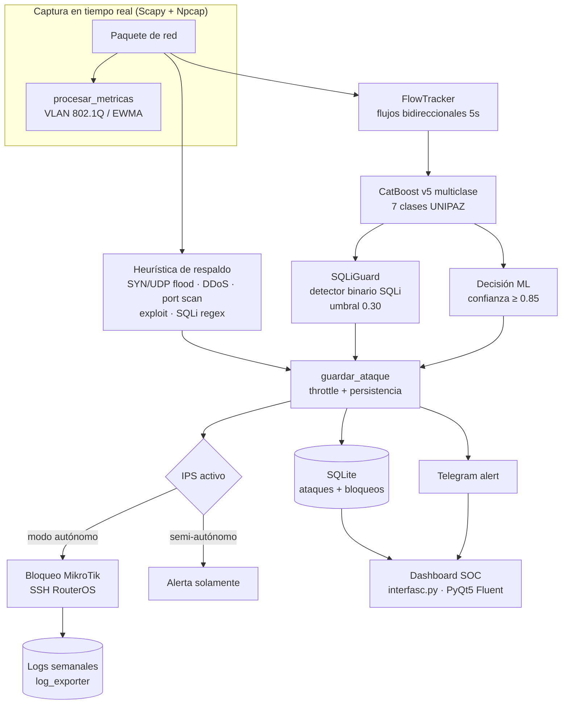

# IPS-IDBS-ML · Sistema IDS/IPS con Machine Learning (UNIPAZ)

Sistema **híbrido de Detección y Prevención de Intrusiones (IDS/IPS)** basado en Machine
Learning para la red del Instituto Universitario de la Paz (UNIPAZ). Combina **captura en
tiempo real** (Scapy + Npcap), **detección heurística**, **clasificación por CatBoost v5**,
una **capa dedicada de confirmación de Inyección SQL (SQLiGuard)** y **respuesta activa IPS**
(bloqueo en MikroTik), con dashboard SOC en PyQt5 y alertas por Telegram.

> Entorno objetivo: **Windows** (24/7), presupuesto **cero**, 100% software libre.

---

## ⚡ Características

- 🕵️ Captura pasiva de paquetes en tiempo real (modo SPAN / port mirror) con `Scapy` + `Npcap`.
- 🧠 **CatBoost v5** (multiclase, 7 clases UNIPAZ) sobre flujos bidireccionales CIC-style.
- 💉 **SQLiGuard**: detector binario dedicado de Inyección SQL entrenado con ~230 K SQLi reales
  (Zenodo 6907252) → precisión **~99.8 %** sobre test externo independiente.
- ⚖️ Heurística de respaldo (SYN/UDP flood, DDoS, port scan, exploit, SQLi regex) con umbrales EWMA dinámicos.
- 🛡️ IPS activo: bloqueo automático o semi-autónomo vía SSH a MikroTik (RouterOS).
- 📊 Dashboard SOC (PyQt5 + Fluent) con eventos, tráfico, gráficos y umbrales ajustables en vivo.
- 🔔 Alertas por Telegram + logs semanales + trazabilidad SQLite (`confianza_ml`, `features_json`).

## 📦 Requisitos previos

| Requisito | Detalle |
|---|---|
| Sistema operativo | Windows 10/11 (objetivo de despliegue; Linux compatible en gran parte) |
| Python | 3.10+ (64 bits) |
| Npcap | Driver de captura (instalado con permisos de administrador) |
| GPU (opcional) | NVIDIA + CUDA para entrenamiento con `task_type='GPU'` |
| Acceso red | Puerto espejo/SPAN en el switch para capturar tráfico clonado |

## 🚀 Instalación rápida

```powershell
# 1. Clonar (incluye modelos subidos con Git LFS)
git clone https://github.com/K-ev1004/Proyecto-IPS-IDBS-ML.git
cd Proyecto-IPS-IDBS-ML

# 2. (Recomendado) Entorno virtual
python -m venv venv
.\venv\Scripts\Activate.ps1

# 3. Instalar dependencias
pip install -r requirements.txt

# 4. Verificar que el driver de captura esté disponible
Get-Process -Name npcap* -ErrorAction SilentlyContinue   # o: sc query npcap
```

> [!NOTE]
> Si el modelo `.pkl` no se descargó con el clon, ejecutar `git lfs pull` (los artefactos
> `v5` y `SQLiGuard` están en `Modelos_Entrenados/` via Git LFS).

## ⚙️ Configuración (variables de entorno)

| Variable | Uso | Obligatoria |
|---|---|---|
| `LOG_FOLDER` | Carpeta donde se escriben los logs semanales y de bloqueo (def. `D:\logs_ciberseguridad` o `logs_ciberseguridad/`) | No |
| `TELEGRAM_BOT_TOKEN` | Token del bot de Telegram (ver `telegram_alert.py`) | Solo si se usan alertas |
| `TELEGRAM_CHAT_IDS` | IDs de chat destino (separados por coma) | Solo si se usan alertas |
| `MIKROTIK_IP` / `MIKROTIK_USER` / `MIKROTIK_PASS` | Credenciales del router para bloqueo IPS | Solo modo autónomo |

> [!CAUTION]
> Las credenciales están **hardcodeadas** en `telegram_alert.py` y `mikrotik_api.py`
> (¡no commitear tokens reales!). Está previsto migrarlas a variables de entorno.

## 🧭 Comandos principales

```powershell
# GUI (recomendado)
python interfasc.py

# Motor IDS/IPS standalone (10 s de captura de prueba)
python ids.py

# Reconstruir dataset global v5 (CIC-IDS2017 + 2018 + DDoS2019)
python generador_dataset_global.py

# Entrenar modelo multiclase v5 (GPU) → Modelos_Entrenados/*v5*
python CEREBRO_V5.py

# Entrenar SQLiGuard (detector binario SQLi)
python entrenar_sqli_guard.py

# Batería de pruebas masivas (datasets sintéticos + trazabilidad)
python test_masivo.py

# Exportar logs semanales
python log_exporter.py
```

## 🏗️ Arquitectura



### Flujo de decisión ML (v5 + SQLiGuard)

1. El flujo completo genera features CIC-style → `pipeline_catboost_v5.pkl` predice la clase.
2. **SQLiGuard** (features NetFlow) confirma o descarta `Inyeccion_SQL`:
   - Si `P(SQLi) ≥ UMBRAL_SQLI_GUARD (0.30)` → se registra como `Inyeccion_SQL` (alta precisión).
   - Si v5 decía SQLi pero SQLiGuard no confirma → no se loguea (reduce falsos positivos).
3. Para el resto de clases se exige `confianza_ml ≥ UMBRAL_ML (0.85)` para loguear y bloquear.

## 📁 Estructura del repositorio

```
.
├── interfasc.py                 # GUI (dashboard SOC PyQt5 Fluent)
├── ids.py                       # Motor principal IDS/IPS (captura, ML, respuesta activa)
├── flujos_red.py                # FlowTracker: flujos bidireccionales y features
├── mikrotik_api.py              # Bloqueo IPS vía SSH a RouterOS
├── telegram_alert.py            # Alertas Telegram
├── log_exporter.py              # Logs semanales y registro de bloqueos
├── generador_dataset_global.py  # Pipeline de datos (CIC 2017+2018+2019) → v5
├── CEREBRO_V5.py                # Entrenamiento CatBoost v5
├── entrenar_sqli_guard.py       # Entrenamiento SQLiGuard
├── test_masivo.py               # Batería de pruebas end-to-end
├── requirements.txt
├── .gitattributes               # Git LFS para *.pkl
├── scripts/legacy/              # Scripts históricos v2/v3 (conservados como evidencia)
├── Modelos_Entrenados/          # Artefactos v5 + SQLiGuard (Git LFS)
├── datasets/                    # Datasets crudos (ignorados en git)
├── Dataset_Limpio/              # Dataset global v5 (ignorado)
├── docs/                        # → Documentación (este proyecto)
│   ├── academico/               # Tesis, anteproyecto e imágenes (docx/pdf/xlsx/tex)
│   ├── adr/                     # Registros de decisiones (ADRs)
│   ├── guias/                   # Guías de instalación, uso y entrenamiento
│   ├── ml/                      # Análisis ML (algunos históricos)
│   ├── red/                     # Arquitectura de red UNIPAZ
│   ├── tesis/                   # Capítulos y anteproyecto (académico)
│   └── CHANGELOG.md             # Historial de cambios del sistema
└── LICENSE                      # (pendiente de definir licencia)
```

## 📚 Documentación

| Sección | Contenido |
|---|---|
| [Guias](./docs/guias/) | Instalación, uso de la GUI y entrenamiento de modelos |
| [ADRs](./docs/adr/) | Decisiones de arquitectura (v5, SQLiGuard, Git LFS) |
| [ML](./docs/ml/) | Análisis técnico y viabilidad de datasets |
| [Red UNIPAZ](./docs/red/) | Topología de red y plan de despliegue |
| [Tesis](./docs/tesis/) | Anteproyecto y capítulos académicos |
| [CHANGELOG](./docs/CHANGELOG.md) | Historial de cambios verificados |

## ✅ Estado del proyecto

- Modelo **v5** en producción: acc 0.8641 · F1-macro 0.7442 · Kappa 0.8138.
- **SQLiGuard**: precisión 99.85 % · recall 75 % (umbral 0.30) en test externo (D2).
- Umbrales unificados: logueo y bloqueo ML con `UMBRAL_ML = 0.85`.
- Ver `docs/CHANGELOG.md` para el detalle completo.

---

*Proyecto académico · Instituto Universitario de la Paz (UNIPAZ) · Ingeniería de Sistemas*
